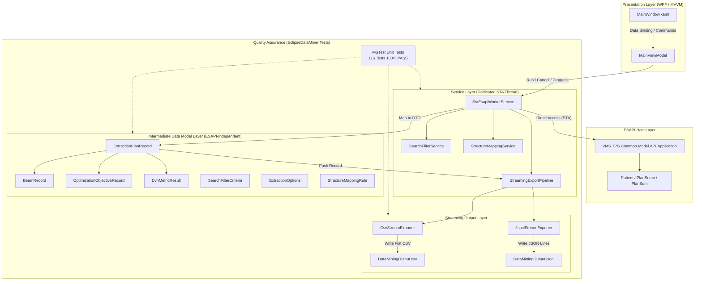
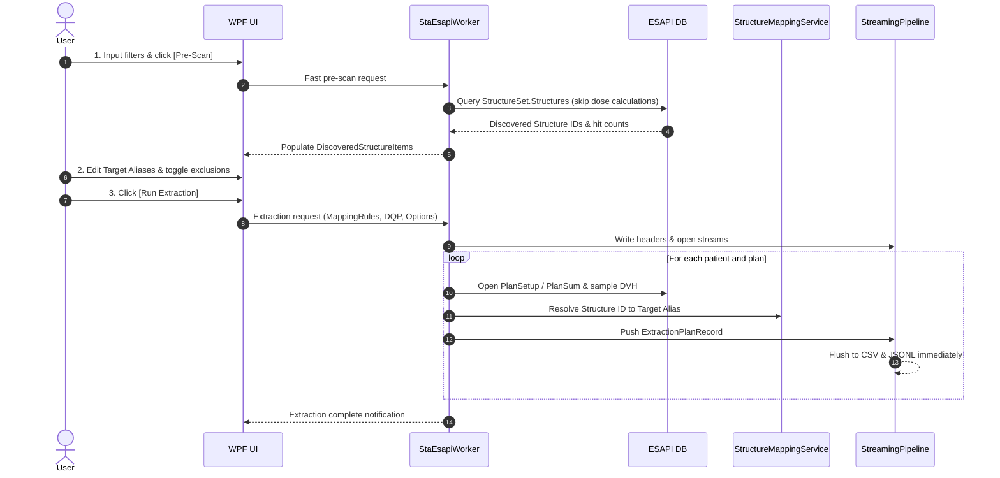

# EclipseDataMiner System Architecture Specification

**English** | [日本語](ARCHITECTURE.md)

## 1. High-Level Architectural Overview

EclipseDataMiner is a standalone WPF application built on the Varian Eclipse Scripting API (ESAPI) to safely and rapidly extract dosimetric, geometric, and metadata parameters from several thousand to 10,000+ radiation therapy plans.

The system is built on **4 core design principles**:

1. **MVVM Pattern & Loose DTO Coupling**: Clean separation between presentation (UI), business logic, ESAPI dependencies, and streaming export layers.
2. **Dedicated STA Worker Thread Isolation**: Full compliance with ESAPI Single-Threaded Apartment (STA) constraints; all queries execute on an isolated background thread without blocking the UI.
3. **Streaming Export Pipeline**: Prevents memory bloat by immediately flushing extracted records to disk on a per-plan / per-patient basis.
4. **Self-Contained Single Executable**: NuGet dependencies are embedded into `EclipseDataMiner.exe` via `Costura.Fody` for seamless zero-install deployment on Eclipse workstations.

---

## 2. Layer Architecture Diagram

---

## 3. Threading Model and Memory Management

### 3.1 Dedicated STA Worker Thread
- ESAPI objects must be created and queried on a Single-Threaded Apartment (STA) thread.
- To eliminate UI freezing, a dedicated background thread is spawned using `Thread.SetApartmentState(ApartmentState.STA)`.
- `Application.CreateApplication()` is instantiated inside this worker thread and cleanly disposed upon extraction completion or cancellation.
- Communication with the UI occurs exclusively via thread-safe `IProgress<ExtractionProgressInfo>` messaging.

### 3.2 Strict Memory Management (LOH & Unmanaged Leak Prevention)
1. **Deterministic Patient Disposal**:
   - Only a single patient is opened in memory at any given time.
   - `Application.ClosePatient()` is guaranteed to be invoked within a `try ... finally` block, preventing patient locks and lingering resources even if an exception occurs.
2. **Periodic Garbage Collection**:
   - Explicit calls to `System.GC.Collect()` and `System.GC.WaitForPendingFinalizers()` occur every 200 patients, purging unmanaged memory caches and ESAPI COM wrappers.
3. **Streaming Disk Export**:
   - Extracted plan records are immediately flushed to disk via `StreamWriter.WriteLine()` rather than accumulated in memory. Working set memory remains flat (under 200 MB) even during 10,000+ plan queries.

---

## 4. Structure Pre-Scan & Nomenclature Mapping Architecture

To address the primary challenge of clinical data mining—structure nomenclature variations (e.g., `PTV_60`, `ptv60`, `PTV-60Gy`)—EclipseDataMiner implements a two-stage pipeline:

---

## 5. Output Format Specifications

### 5.1 Normalized Flat CSV
- **Encoding**: UTF-8 (BOM supported)
- **Delimiter**: Comma (`,`)
- **Granularity**: 1 row per plan (flat tabular format).
- **One-to-Many Aggregation**: Multi-beam records and optimization objectives are joined by semicolons (`;`) into single cells.
- **Sanitization**: Newlines (`\r\n`, `\n`) are replaced with spaces, and fields containing commas or quotes are escaped with double quotes (`""`).
- **Missing Values**: Uncalculated or non-applicable fields output `N/A`.

### 5.2 JSON Lines (`.jsonl`)
- **Granularity**: 1 JSON object per line.
- **Hierarchical Fidelity**: Preserves full object structures (`Beams`, `OptimizationObjectives`, `DvhMetrics`) without flattening.
- **Target Applications**: Tailored for Python data science (Pandas, Polars), PyTorch, and machine learning pipelines.

### 5.3 Patient De-Identification & Privacy
- When `AnonymizeOutput` is enabled:
  - `Patient ID`: Replaced with salted SHA-256 hash (64-character hexadecimal string).
  - `DateOfBirth`, `PlanningApprover`: Replaced with `REDACTED`.

---

## 6. Packaging and Binary Compatibility

- **Target Framework**: .NET Framework 4.6.1 (Fully compatible with Eclipse v15.6 and v16.1)
- **Platform Architecture**: `x64` (AMD64)
- **Costura.Fody Embedding**:
  - Bundles dependencies (`CommunityToolkit.Mvvm.dll`, `System.Text.Json.dll`, etc.) directly inside `EclipseDataMiner.exe`.
  - Excludes `VMS.TPS.Common.Model.API.dll` and `VMS.TPS.Common.Model.Types.dll` via `ExcludeAssemblies` to dynamically link against workstation GAC / official installation assemblies.
