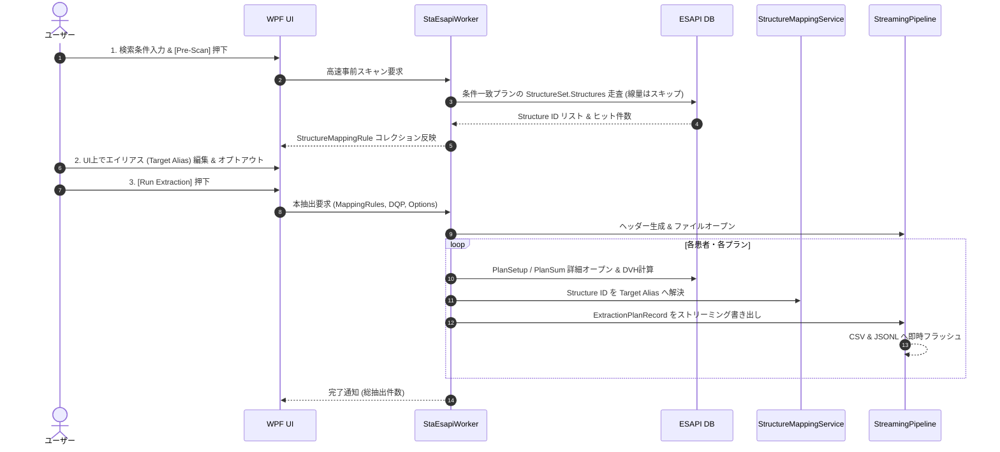

# EclipseDataMiner システム・アーキテクチャ設計書

## 1. 全体アーキテクチャ概要

EclipseDataMiner は、Varian Eclipse Scripting API (ESAPI) を用いて数千〜10,000件規模の放射線治療計画から線量・幾何・メタデータを高速・安全に抽出するスタンドアロン型 WPF アプリケーションです。

本システムは以下の **4つのコア設計思想** に基づいて設計されています：

1. **MVVM パターンと DTO 疎結合**: UI層、ビジネスロジック層、ESAPI依存層、出力層を明確に分離。
2. **STA ワーカースレッド・アイソレーション**: ESAPI の Single-Threaded Apartment (STA) 制約を遵守し、UI スレッドを一切ブロックしない専用ワーカースレッドを採用。
3. **ストリーミング・パイプライン**: メモリ肥大化を防ぐため、1患者・1プランごとにディスクへ即時フラッシュ。
4. **自己完結型単一バイナリ**: `Costura.Fody` により NuGet 依存アセンブリを内包し、Eclipse 端末への単一ファイル配備を実現。

---

## 2. レイヤー構成図

```mermaid
graph TD
    subgraph Presentation_Layer [プレゼンテーション層 (WPF / MVVM)]
        View[MainWindow.xaml]
        VM[MainViewModel]
        View -->|Data Binding / Commands| VM
    end

    subgraph Service_Layer [サービス層 (専用 STA スレッド)]
        StaWorker[StaEsapiWorkerService]
        FilterSvc[SearchFilterService]
        MapSvc[StructureMappingService]
        Pipeline[StreamingExportPipeline]
        VM -->|Run / Cancel / Progress| StaWorker
        StaWorker --> FilterSvc
        StaWorker --> MapSvc
        StaWorker --> Pipeline
    end

    subgraph DTO_Layer [中間データモデル層 (ESAPI 非依存)]
        PlanDto[ExtractionPlanRecord]
        BeamDto[BeamRecord]
        OptDto[OptimizationObjectiveRecord]
        DvhDto[DvhMetricResult]
        Criteria[SearchFilterCriteria]
        Options[ExtractionOptions]
        Rules[StructureMappingRule]
        PlanDto --> BeamDto
        PlanDto --> OptDto
        PlanDto --> DvhDto
    end

    subgraph Output_Layer [ストリーミング出力層]
        CsvExp[CsvStreamExporter]
        JsonlExp[JsonlStreamExporter]
        Pipeline --> CsvExp
        Pipeline --> JsonlExp
        CsvExp -->|Write Flat CSV| DiskCSV[DataMiningOutput.csv]
        JsonlExp -->|Write JSON Lines| DiskJSONL[DataMiningOutput.jsonl]
    end

    subgraph Host_Layer [ESAPI ホスト層]
        EsapiApp[VMS.TPS.Common.Model.API.Application]
        EsapiPat[Patient / PlanSetup / PlanSum]
        StaWorker -->|Direct Access (STA)| EsapiApp
        EsapiApp --> EsapiPat
    end

    subgraph Test_Layer [品質保証 (EclipseDataMiner.Tests)]
        Tests[MSTest Unit Tests<br/>107 Tests 100% PASS]
        Tests -.-> DTO_Layer
        Tests -.-> Service_Layer
        Tests -.-> Output_Layer
    end

    StaWorker -->|Map to DTO| PlanDto
    PlanDto -->|Push Record| Pipeline
```

---

## 3. スレッドモデルとメモリ管理

### 3.1 専用 STA ワーカースレッド
- ESAPI のオブジェクトモデルは STA (Single-Threaded Apartment) スレッドで初期化・実行される必要があります。
- UI スレッドでの同期呼び出し（フリーズ原因）を排除するため、`Thread.SetApartmentState(ApartmentState.STA)` で専用バックグラウンドスレッドを立ち上げます。
- `Application.CreateApplication()` は本スレッド内で生成され、処理完了またはキャンセル時に `Dispose()` されます。
- UI とのやり取りは `IProgress<ExtractionProgressInfo>` を介したメッセージングのみに限定されます。

### 3.2 厳格なメモリ管理（LOH・アンマネージドリーク対策）
1. **患者リソースの決定論的解放**:
   - 同時に開く患者は常に 1 名のみ。
   - `try ... finally` ブロック内で確実に `Application.ClosePatient()` を呼び出し、例外発生時も患者ロックやリソース残留を防止。
2. **定期的ガベージコレクション**:
   - 200 患者ごとに `System.GC.Collect()` および `System.GC.WaitForPendingFinalizers()` を明示的に呼び出し、ESAPI の内部キャッシュやアンマネージドメモリを定期解放。
3. **ストリーミング書き出し**:
   - 抽出結果を全件メモリに蓄積せず、1 プランごとに `StreamWriter.WriteLine()` で即時ファイルへ出力。10,000 件走査時もアプリケーションのメモリ消費量は数十 MB 程度で平坦に推移します。

---

## 4. 事前マッピング＆エイリアス統合アーキテクチャ

放射線治療計画のデータマイニングにおいて最大の課題となる「輪郭名の表記揺れ（例: `PTV_60`, `ptv60`, `PTV-60Gy`）」を解決するため、2段階のパイプラインを採用しています。



---

## 5. 出力フォーマット仕様

### 5.1 正規化 CSV 出力
- **文字コード**: UTF-8 (BOM なし / あり対応)
- **区切り文字**: カンマ (`,`)
- **1行 1プラン**: 治療計画 1 件につき 1 行を出力するフラット構造。
- **1対N項目の集約**: ビーム情報、最適化条件等はセミコロン (`;`) で連結して 1 つのセルに格納。
- **サニタイズ**: 改行コード（CRLF, LF）は半角スペースに置換、カンマや二重引用符を含む文字列は `""` でエスケープ。
- **欠損値**: 未計算項目や非該当項目には `N/A` を出力。

### 5.2 JSON Lines (`.jsonl`) 出力
- **1行 1JSON**: 各プランの全階層構造（Beams, OptimizationObjectives, DvhMetrics 等）を保持したまま、改行区切りの JSON としてシリアライズ。
- **用途**: Python (Pandas / Polars)、PyTorch、scikit-learn 等での機械学習・統計解析パイプラインに最適。

### 5.3 匿名化処理
- `AnonymizeOutput` オプション有効時：
  - `Patient ID`: ソルト付き SHA-256 ハッシュ（64 桁 16 進数文字列）に置換。
  - `DateOfBirth`, `PlanningApprover`: `REDACTED` にマスク。

---

## 6. パッケージングとバイナリ互換性

- **フレームワーク**: .NET Framework 4.6.1 (Eclipse v16.1 / v15.6 互換)
- **ビルド構成**: x64 (AMD64)
- **Costura.Fody 設定**:
  - `CommunityToolkit.Mvvm.dll`, `System.Text.Json.dll` 等の NuGet 依存ライブラリを `EclipseDataMiner.exe` 内に埋め込み。
  - `VMS.TPS.Common.Model.API.dll` および `VMS.TPS.Common.Model.Types.dll` は **ExcludeAssemblies** に設定し、内包から除外（Eclipse 端末側の公式 GAC / インストールアセンブリを参照）。
