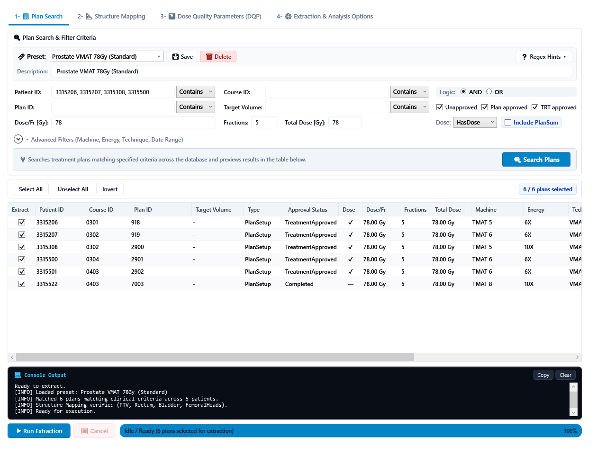
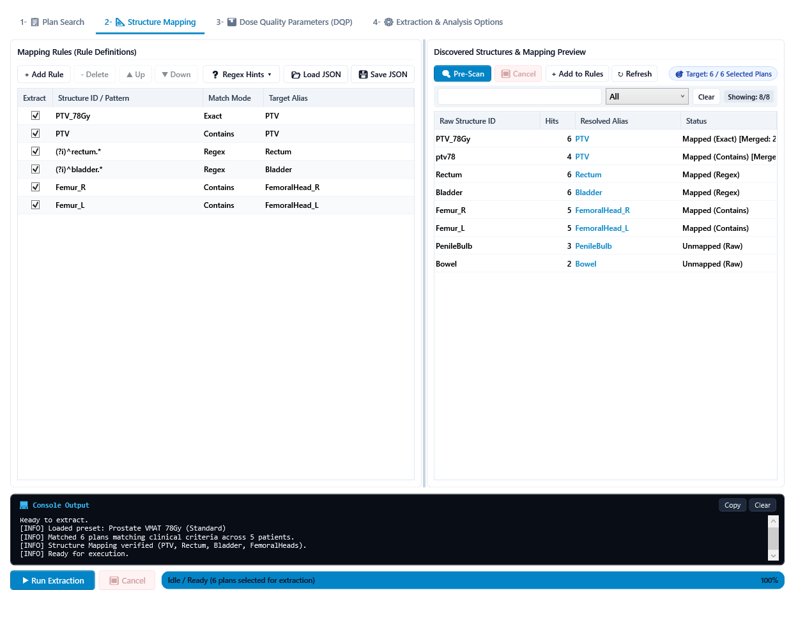
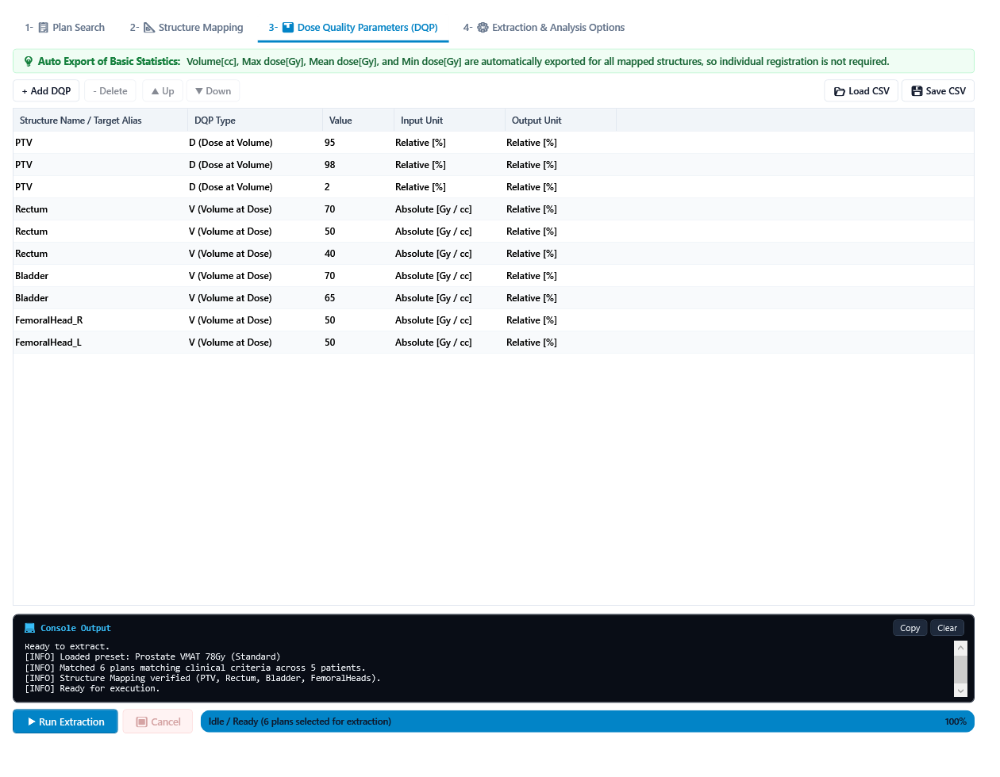
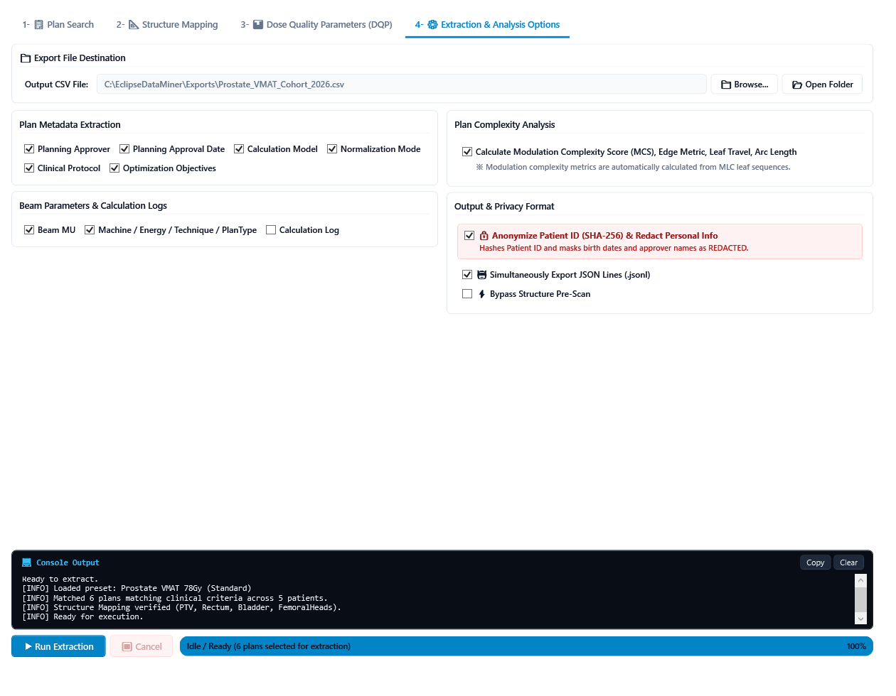

# EclipseDataMiner User Manual (v3.0.0)

**English** | [日本語](MANUAL.md)

This document is the official operational guide and comprehensive technical reference for **EclipseDataMiner v3.0.0**.  
*Note: The user interface (UI) of this application is displayed in English by default. This manual references all UI components using their exact English labels.*

---

## 1. Overview and UI Layout

EclipseDataMiner is a standalone WPF application that cross-searches the Varian Eclipse (ESAPI) database for treatment plans matching complex clinical criteria, and safely extracts Dose-Quality Parameters (DQP), delivery parameters, and plan modulation complexity metrics (MCS, Edge Metric, Leaf Travel Length, Arc Length) with high throughput and low memory usage.

The main window consists of **4 numbered tabs at the top**, a **dark terminal console in the middle**, and an **execution control bar with a progress bar at the bottom**:

```
+-------------------------------------------------------------------+
| [1- Plan Search] [2- Structure Mapping] [3- DQP] [4- Options]     |
|                                                                   |
| << Tab 1: 1- Plan Search >>                                       |
| - CARD: Plan Search & Filter Criteria                             |
|   - Patient / Course / Plan / Target / Dose / Status / Advanced   |
|   - [ Quick Scan Database and Preview Plans   [Search Plans] ]    |
| - TABLE: Matched Plans (Full Metadata & Delivery Dates)           |
|   - [Select All] [Unselect All] [Invert] (Select Plans to Extract)|
|                                                                   |
| << Tab 4: 4- Extraction & Analysis Options >>                     |
| - CARD: Export Destination ( CSV Path ... [Browse] [Open Folder] )|
| - CARD: Metadata / Complexity / Output & Privacy Formats          |
+-------------------------------------------------------------------+
| CARD: Console Output  [Copy] [Clear]                              |
| [ Dark Slate Terminal Console (Auto-scroll, Consolas font) ]      |
+-------------------------------------------------------------------+
| [▶ Run Extraction] [⏹ Cancel]  [======= 42% =======]            |
| Status: Processing patient 42/100 (Extracted plans: 84)...        |
+-------------------------------------------------------------------+
```


---

## 2. Four Main Tabs Overview

| Tab Number & Name | Key Function |
| :--- | :--- |
| **1- 📋 Plan Search** | Define search filters (Patient ID, Plan ID, Prescription Dose, Approval Status, Machine, Date Range) and manage presets. Rapidly scan the database and select target plans via checkboxes. |
| **2- 📐 Structure Mapping** | High-speed pre-scan of structure nomenclatures across target plans (`PTV_60`, `ptv60`, `PTV-60Gy`, etc.) and consolidate variations into unified Target Aliases. |
| **3- 📊 Dose Quality Parameters (DQP)** | Configure dose/volume evaluation metrics (e.g., D95%, V20Gy, Mean, Max) with CSV import/export. Note: Basic statistical parameters (Volume, Min, Mean, Max) are automatically exported without manual registration. |
| **4- ⚙️ Extraction & Analysis Options** | Output CSV file path, delivery parameters, plan complexity metrics (MCS / Edge Metric), SHA-256 patient de-identification, and JSONL streaming options. |

---

## 3. Step-by-Step Workflow

The standard operational workflow proceeds sequentially through the numbered tabs (**Tab 1 → Tab 2 → Tab 3 → Tab 4 → Bottom Execution Bar**):

```
[Tab 1: Plan Search]       ->  [Tab 2: Structure Mapping]
 Define criteria & search       Pre-scan structures & define rules
 (Exact/Contains, select)       (Collect structures from selected plans)
         ↓                               ↓
[Tab 3: DQP Config]        ->  [Tab 4: Options & Execution]
 Add DVH metrics (D95%, etc.)   Output path, anonymization & [▶ Run]
```

---

### Step 1: Define Plan Search Criteria & Select Plans (Tab 1: 1- 📋 Plan Search)



1. **Search & Filter Criteria**:
   - **Search Presets (Presets) & Protocol Descriptions**:
     - The **"🔖 Preset:"** bar at the top of the card allows you to save, load, and delete clinical search criteria sets with a single click.
     - **In-place Description Editing**: When a preset is selected, its description is displayed in an editable text box. You can annotate clinical protocols or trial numbers directly and click **"💾 Save"** to persist both criteria and descriptions.
     - **Storage Location (`Presets/` Folder)**: Presets are stored as individual JSON files in the `Presets/` folder alongside the application (e.g., `Presets/Prostate VMAT 78Gy.json`). This enables simple backup and sharing between workstations. Pre-configured samples are provided in `Templates/Presets/`.
   - **Patient ID / Course ID / Plan ID / Target Volume**:
     - Supports comma-separated multiple OR searches (e.g., `1001, 1002, 2005` or `VMAT, IMRT`).
     - **NOT / Exclusion Filters (`!` or `-`)**: Prefixing a keyword with `!` or `-` excludes plans matching that pattern (e.g., `VMAT, IMRT, !QA, !Test`).
     - **Match Mode Selection (Contains / Exact / Regex)**:
       - `Contains` (Default): Substring matching, case-insensitive.
       - `Exact`: Strict exact match. Specifying `Exact` with `Plan` matches only `Plan`, excluding `Plan1` or `MyPlan`.
       - `Regex`: Full regular expression matching (e.g., `^Plan_\d+$` or `(VMAT|IMRT)_Prostate`).
     - **Regex Cheat Sheet (`❓ Regex Hints ▾`)**:
       - Click to open clinical regex patterns for Plan ID and Patient ID. Click **"Insert"** to automatically insert the pattern and switch mode to Regex.
   - **Prescription Dose & Fraction Criteria (Dose/Fr, Fractions, Total Dose)**:
     - Supports exact values (`78`, `2.0`), numeric ranges (`70-80` or `70 ~ 80`, fractions `33-35`), and inequalities (`>= 10`, `< 30`, `<= 5`).
     - Plans with uncalculated doses or `NaN` / `Infinity` are strictly excluded.
   - **Dose Calculation Status (Dose Presence: All / HasDose / NoDose)**:
     - `All`: All plans regardless of dose calculation status (default).
     - `HasDose`: Matches **only plans with calculated 3D dose**.
     - `NoDose`: Matches **only uncalculated plans** (e.g., preliminary contouring or beam setup plans).
   - **Global Logic Switch (AND / OR)**:
     - `AND`: Plan must satisfy **all** specified criteria.
     - `OR`: Plan matches if **any single** criterion is satisfied.
   - **Approval Status / Include PlanSum**:
     - Checkboxes for `Unapproved`, `Plan approved`, and `TRT approved`.
     - Check `Include PlanSum` to include composite plan sums in search results.
   - **Advanced Filters (Machine, Energy, Technique, Date Range)**:
     - Expand `▾ Advanced Filters` to filter by delivery equipment and dates:
       - `Machine ID` (e.g., `TrueBeam, Clinac_iX, !QA_Linac`)
       - `Energy` (e.g., `6X, 10X, !6FFF`)
       - `Technique` (e.g., `ARC, STATIC, !SRS`)
       - `Date Target` (`TreatmentApprovalDate`, `PlanningApprovalDate`, `CreationDate`) and `Date Range` (`From` 〜 `To`).

2. **Execute Plan Search (🔍 Search Plans)**:
   - Click **"🔍 Search Plans"** in the blue footer bar. Matching plans are scanned from the ESAPI database and listed in the table below.
   - The table summarizes aggregated beam parameters (Machine, Energy, Technique), delivery dates, and dose calculation markers (Dose column).

3. **Select Plans in the Matched Plans DataGrid (`Extract` Column Checkboxes)**:
   - Use the **`Extract`** checkboxes in the first column to select or exclude individual plans.
   - Toolbar buttons: **"Select All"**, **"Unselect All"**, and **"Invert"** allow batch toggling.
   - **Selection Propagation**:
     - **Checked plans (`Extract = true`) are directly propagated to Step 2 (Structure Mapping Pre-Scan) and Step 5 (Run Extraction).**
     - This prevents wasteful full-database queries and pinpoints processing only to the selected plans.

---

### Step 2: Structure Pre-Scan & Nomenclature Mapping (Tab 2: 2- 📐 Structure Mapping)

Consolidate institutional naming variations (e.g., `PTV_60`, `ptv60`, `PTV-60Gy`) into unified column headers (Target Alias). The tab features a 2-pane layout separated by a draggable GridSplitter.



1. Open **Tab 2: 2- 📐 Structure Mapping**.
2. **Right Pane: Execute Structure Pre-Scan (🔍 Pre-Scan)**:
   - Click **"🔍 Pre-Scan"** (Primary Button).
   - **Automatic Scope Detection**:
     - Scans structures **only within plans checked in Tab 1 (`Extract = true`)**.
     - The scope badge on the toolbar (`🎯 Target: 3 / 3 Selected Plans`) displays the target count in real time.
     - If search was not executed in Tab 1, all plans matching criteria are scanned (`🌐 Target: All Criteria Matching Plans`).
     - **Executing pre-scan does not overwrite or clear rules in the left pane**.
   - Upon scan completion, all discovered Structure IDs, occurrence counts (Count), resolved aliases, and match status are displayed.
3. **Left Pane: Mapping Rule Management**:
   - **📂 Load JSON / 💾 Save JSON**: Load pre-configured mapping dictionaries (e.g., `Templates/StructureMapping_Prostate.json`) and save edited dictionaries.
   - **+ Add Rule / - Delete Selected**: Add or delete rules (supports continuous deletion via the Delete key).
   - **▲ Up / ▼ Down**: Adjust rule evaluation order (supports keyboard shortcuts `Alt+Up/Down` and `Ctrl+Up/Down`).
   - **Target Alias / Match Mode**:
     - Choose `Exact` (strict match), `Contains` (substring), or `Regex` (regular expression).
     - **Specificity Priority (`Exact` > `Contains` > `Regex`)**: Exact matches take precedence, followed by Contains, and lastly Regex. This allows comprehensive regex rules and specific exceptions to coexist safely.
     - **Real-time Syntax Validation**: Invalid regex patterns highlight the cell with a red border and display tooltip error messages.
     - **❓ Regex Hints ▾**: Insert common clinical regular expression snippets with one click.
   - **Extract Checkbox**: Uncheck structures that should be excluded from extraction (e.g., Couch, Marker).
4. **Inspect Preview & Add Discovered Items**:
   - Filter structures in the right pane using quick search, status filters (`All` / `Unmapped Only` / `Mapped Only` / `Excluded Only`), or click **"↻ Refresh"** to re-evaluate rules immediately.
   - **Double-click** any structure row or click **"+ Add to Rules"** to immediately add it as a new rule in the left pane and refresh the preview.
   - When multiple raw structures map to the same Target Alias, the status annotates `[Merged: N]`.
5. **Bypass Structure Pre-Scan**:
   - If using an established rule dictionary, check **"Bypass Structure Pre-Scan"** in Tab 4 to skip the pre-scan confirmation prompt.

---

### Step 3: Dose Quality Parameters (DQP) Configuration (Tab 3: 3- 📊 Dose Quality Parameters)



1. Open **Tab 3: 3- 📊 Dose Quality Parameters (DQP)**.
2. **Automatic Baseline DVH Statistics & Normalization Reference**:
   - **Baseline statistics (`Volume[cc]`, `Max dose[Gy]`, `Mean dose[Gy]`, `Min dose[Gy]`) are automatically exported for all mapped structures**. You do not need to register them individually.
   - **Standard Plan (`PlanSetup`) Relative Dose Normalization**:
     - Relative dose (%) is normalized against the plan's **Total Prescription Dose (`TotalDose`)**.
   - **Composite Plan (`PlanSum`) Relative Dose Calculation Behavior**:
     - `PlanSum` is a composite of multiple treatment plans, and by ESAPI specification, does not possess a single `TotalDose` prescription dose.
     - **Relative Input Dose (`InputUnit = Relative [%]`, e.g., `V70%`)**: Falls back to using the **structure's Maximum Dose (`Max dose`)** as the 100% reference dose (e.g., `V50%` calculates volume receiving 50% of the structure's maximum dose).
     - **Relative Output Dose (`OutputUnit = Relative [%]`, e.g., `D95%[%]`)**: If composite normalization is unconfigured in Eclipse, outputs **`N/A`** safely.
     - **Relative Volume (%)**: Evaluated against the physical structure volume and computes normally on PlanSums (e.g., `D95%[Gy]`, `V50Gy[%]`).
     - **Clinical Recommendation**: For cohorts including `PlanSum`, it is strongly recommended to specify dose criteria in **Absolute Dose [Gy]** (e.g., `D95%[Gy]`, `V50Gy[%]`, `D0.1cc[Gy]`) to ensure consistent dosimetric evaluation.
3. **Add, Edit, and Delete DQP Metrics**:
   - **+ Add DQP**: Add a new evaluation metric row.
   - **- Delete Selected**: Remove selected row (supports continuous Delete key deletion).
   - **▲ Up / ▼ Down**: Reorder evaluation metrics (supports keyboard shortcuts `Alt+Up/Down` and `Ctrl+Up/Down`).
   - **Structure Name / Alias**: Target structure name or Target Alias defined in Step 2.
   - **DQP Type**:
     - `D (Dose at Volume)`: Dose at a specific volume (e.g., D95%, D0.1cc).
     - `V (Volume at Dose)`: Volume receiving a specific dose (e.g., V20Gy, V70%).
     - `DC (Dose Complement)`: Dose complement.
     - `CV (Complement Volume)`: Complement volume.
   - **Value / Input Unit / Output Unit**: Set numeric value, input unit (`Relative [%]` / `Absolute [Gy / cc]`), and output unit.
4. **📂 Load CSV / 💾 Save CSV**: Save and load protocol templates in CSV format (Header: `structureName,DQPtype,DQPvalue,InputUnit,OutputUnit`).

---

### Step 4: Output Destination & Analysis Options (Tab 4: 4- ⚙️ Extraction & Analysis Options)



1. Open **Tab 4: 4- ⚙️ Extraction & Analysis Options**.
2. **Export File Destination**:
   - **Browse...**: Select destination folder and CSV file name (Default: `DataMiningOutput.<timestamp>.csv`).
   - **Open Folder**: Open output directory in Windows File Explorer.
3. **Card 1: Plan Metadata & Beam Parameters**:
   - Planning Approver, Approval Date, Calculation Model, Normalization Mode, Clinical Protocol, Optimization Objectives.
   - Beam MU, Machine / Energy / Technique / PlanType, Calculation Logs (newlines sanitized).
4. **Card 2: Complexity Analysis, Privacy & Output Formats**:
   - **Plan Complexity Analysis**: Computes Modulation Complexity Score (MCS), Edge Metric, Leaf Travel Length, and Arc Length.
   - **Anonymize Patient ID & Redact Personal Info**: Hashes Patient ID via SHA-256 and masks birth dates and approver names as `REDACTED`.
   - **Simultaneously Export JSON Lines (.jsonl)**: Exports hierarchical `.jsonl` file alongside CSV for ML / AI pipelines.
   - **Bypass Structure Pre-Scan**: Bypasses the structure pre-scan confirmation dialog.

---

### Step 5: Execute Data Mining & Monitor Progress

1. Click the large ocean-blue **"▶ Run Extraction"** button in the bottom control bar.
   - **If plans were selected in Tab 1**: Only plans with `Extract = true` are extracted.
   - **If search was bypassed**: All matching plans across the database are directly processed.
2. The operational status badge updates to `EXTRACTING`, and the progress bar reflects real-time progress.
3. **Dark Terminal Console**:
   - Real-time logging of patient opening, DVH sampling, and memory collection using `Consolas` font.
   - Click **"📋 Copy"** to copy logs to clipboard or **"🗑 Clear"** to clear display.
4. **Instant Safe Cancellation (⏹ Cancel)**:
   - Click the red **"⏹ Cancel"** button to abort extraction safely.
   - Cooperative cancellation stops execution within milliseconds without file corruption. All plans extracted prior to cancellation remain safely saved on disk.
5. Upon completion, a summary dialog appears, and output files are ready for analysis.

---

## 4. Output Data Specifications & Comprehensive Column Reference

EclipseDataMiner exports a **normalized flat CSV (1 row = 1 plan, UTF-8 with BOM)** and a **hierarchical JSON Lines (`.jsonl`)** format designed for seamless ingestion into Python, R, and machine learning pipelines.

---

### 4.1 Normalized Flat CSV Output - Full Column Reference

Each row in the exported CSV consists of the following logical column groups in order:
1. **Core Plan Information Columns** (11 standard columns, always exported)
2. **Optional Plan Metadata & Beam Parameter Columns** (up to 10 columns enabled via Tab 4 checkboxes)
3. **Automatic Baseline Structure Statistics** (4 standard columns per mapped structure alias)
4. **Dynamic Dose Quality Parameters (DQP) Columns** (custom DVH metrics configured in Tab 3)

#### 1. Core Plan Information Columns (Core Columns: Always Exported)

| Column Header | Data Type / Unit | Detailed Description & Clinical Specification | Example / Default Value |
| :--- | :--- | :--- | :--- |
| **`Patient ID`** | String (string) | Patient identification number. When "Anonymize Patient ID" is enabled in Tab 4, replaced with an irreversible salted SHA-256 hash (64 hex characters). | `12345678` or `e3b0c44298fc1c149afbf4...` |
| **`Course ID`** | String (string) | Eclipse course identifier (`Course.Id`). | `C1`, `Course1` |
| **`Date of birth`** | Date (yyyy-MM-dd) | Patient date of birth. Masked as `REDACTED` when anonymization is enabled. Defaults to `N/A` if unrecorded. | `1955-04-12` or `REDACTED` |
| **`Plan ID`** | String (string) | Treatment plan identifier (`PlanSetup.Id` or `PlanSum.Id`). | `VMAT_Prostate`, `PlanSum1` |
| **`Target volume`** | String (string) | Target structure ID linked to the plan (`TargetVolumeId`). Defaults to `N/A` if unassigned. | `PTV_78Gy`, `PTV` |
| **`DosePerFraction[Gy]`** | Float [Gy] | Prescribed dose per fraction. Automatically unified to Gray [Gy] rounded to 2 decimal places. `N/A` if uncalculated. | `2.00` |
| **`NumberOfFractions`** | Integer (int) | Number of treatment fractions. Defaults to `N/A` if uncalculated. | `39`, `35` |
| **`TotalDose[Gy]`** | Float [Gy] | Total prescribed dose (`DosePerFraction * NumberOfFractions`). Unified to Gray [Gy] (2 decimal places). `N/A` if uncalculated. | `78.00`, `70.00` |
| **`NumberOfBeams`** | Integer (int) | Total number of treatment beams (excluding setup beams). For plan sums (`PlanSum`), outputs `0`. | `2`, `4` |
| **`ApprovalStatus`** | String (string) | Plan approval status in Eclipse: `TreatmentApproved`, `PlanApproved`, `Unapproved`, or `PlanSum`. | `TreatmentApproved` |
| **`IsPlanSum`** | Boolean (bool) | Boolean flag identifying whether the record is a plan sum (`True`) or a single plan setup (`False`). | `True` or `False` |

#### 2. Optional Plan Metadata & Beam Parameter Columns (Optional Columns)

Appended dynamically based on checkboxes in Tab 4 ("Plan Metadata", "Beam Parameters & Calculation Logs", "Plan Complexity Analysis"):

| Column Header | Enabling Option | Detailed Description & Clinical Specification | Example / Format |
| :--- | :--- | :--- | :--- |
| **`PlanningApprover`** | Planning Approver | Eclipse username of staff who approved the plan. Masked as `REDACTED` when anonymized; `N/A` if unapproved. | `physicist01` or `REDACTED` |
| **`PlanningApprovalDate`** | Planning Approval Date | Plan approval timestamp (`yyyy-MM-dd HH:mm:ss`). Defaults to `N/A` if unapproved. | `2026-06-15 14:30:00` |
| **`MU`** | Beam MU | Monitor Units (MU) for each beam concatenated with semicolons (`;`). Format: `BeamID:MU`. Outputs `N/A` for PlanSum. | `B1:145.2;B2:138.6` |
| **`Machine/Energy/Tech/PlanType`** | Machine / Energy / Tech / PlanType | Hardware and delivery technique specification per beam concatenated with semicolons. Format: `BeamID(Machine/Energy/Tech/PlanType)`. | `B1(TrueBeam/6X/ARC/VMAT);B2(TrueBeam/6X/ARC/VMAT)` |
| **`CalculationModel`** | Calculation Model | Dose calculation algorithm models for photon and electron models delimited by slash (`/`). | `AAA_16.1.0/N/A` or `AcurosXB_16.1.0/N/A` |
| **`CalculationLog`** | Calculation Logs | Execution log of dose calculation algorithm. All internal newlines (`\r\n`, `\n`) are sanitized into single spaces to preserve CSV integrity. `N/A` if absent. | `Calculation completed in 12.4s; Grid: 2.5mm...` |
| **`PlanNormalizationMethod`** | Normalization Mode | Description string of dose normalization mode (e.g., target volume mean, specific point). | `100.0% in target PTV` |
| **`ClinicalProtocol`** | Clinical Protocol | Associated clinical protocol or clinical trial template name. | `JCOG1408_Lung`, `RTOG0534` |
| **`OptimizationObjectives`** | Optimization Objectives | Semicolon-delimited list of all optimization objectives. Format: `Structure:ObjectiveType:Dose/Volume:Priority`. Outputs `N/A` if absent (e.g. 3D-CRT). | `PTV:Upper:70.0Gy:100;Rectum:Upper:50.0Gy:80` |
| **`PlanComplexity`** | Plan Complexity | Literature-validated geometric beam delivery complexity metrics aggregated across all treatment beams:<br/>- **`MCS`**: Modulation Complexity Score (Masi 2013 [0–1], closer to 1 is simpler)<br/>- **`EdgeMetric`**: Perimeter-to-area ratio (Younge 2012 [mm⁻¹])<br/>- **`LeafTravel`**: Total leaf travel distance [mm]<br/>- **`ArcLength`**: Total gantry rotation angle [deg]<br/>- **`AAV`**: Area Aperture Variation<br/>- **`LSV`**: Leaf Sequence Variation | `MCS=0.342;EdgeMetric=0.087;LeafTravel=1420.5;ArcLength=358.0;AAV=0.512;LSV=0.668` |

#### 3. Automatic Baseline Structure Statistics (Automatic Baseline Structure Statistics)

For every structure mapped in Tab 2 (`IsSelected = true`), **these four fundamental DVH statistics are automatically exported without requiring manual DQP metric entry**:

| Column Header | Unit | Detailed Description & Clinical Specification | Example |
| :--- | :--- | :--- | :--- |
| **`<Alias>-Volume[cc]`** | cc (cm³) | Geometric structure volume rounded to 2 decimal places. Outputs `N/A` if structure is absent in the plan. | `42.50` |
| **`<Alias>-Max dose[Gy]`** | Gray [Gy] | Maximum dose within the structure. Automatically unified from cGy to Gy rounded to 2 decimal places. | `81.25` |
| **`<Alias>-Mean dose[Gy]`** | Gray [Gy] | Mean dose within the structure in Gray [Gy] (2 decimal places). | `78.40` |
| **`<Alias>-Min dose[Gy]`** | Gray [Gy] | Minimum dose within the structure in Gray [Gy] (2 decimal places). | `71.10` |

*Example*: If `PTV` and `Rectum` are mapped as Target Aliases, 8 baseline columns are automatically generated: `PTV-Volume[cc]`, `PTV-Max dose[Gy]`, `PTV-Mean dose[Gy]`, `PTV-Min dose[Gy]`, `Rectum-Volume[cc]`, `Rectum-Max dose[Gy]`, `Rectum-Mean dose[Gy]`, `Rectum-Min dose[Gy]`.

#### 4. Dynamic Dose Quality Parameters (DQP) Columns (Dynamic DQP Columns)

Each dose-volume parameter registered in Tab 3 is sampled in real-time from the 3D dose grid (DVH) and exported using the configured output unit:

| Column Header Pattern | Metric Type (DQP Type) | Calculation Logic & Details | Example |
| :--- | :--- | :--- | :--- |
| **`<Alias>-D<Value>%[Gy]`** | Dose at Volume (D) | Dose [Gy] received by specified relative volume (%). | `PTV-D95%[Gy]` -> `74.50` |
| **`<Alias>-D<Value>cc[Gy]`** | Dose at Volume (D) | Dose [Gy] received by specified absolute volume (cc). Standard for small-volume hotspot evaluation. | `SpinalCord-D0.1cc[Gy]` -> `42.10` |
| **`<Alias>-D<Value>%[%]`** | Dose at Volume (D) | Relative dose [%] received by specified volume (normalized against Total Prescription Dose). | `PTV-D98%[%]` -> `96.50` |
| **`<Alias>-V<Value>Gy[%]`** | Volume at Dose (V) | Volume percentage [%] receiving specified dose [Gy]. Standard for OAR tolerance evaluation. | `Rectum-V70Gy[%]` -> `12.30` |
| **`<Alias>-V<Value>%[%]`** | Volume at Dose (V) | Volume percentage [%] receiving specified percentage of prescription dose. | `Bladder-V70%[%]` -> `25.40` |
| **`<Alias>-V<Value>Gy[cc]`** | Volume at Dose (V) | Absolute volume [cc] receiving specified dose [Gy]. | `Rectum-V50Gy[cc]` -> `15.20` |
| **`<Alias>-DC<Value>%[Gy]`** | Dose Complement (DC) | Dose [Gy] received by complement volume. | `PTV-DC95%[Gy]` -> `72.80` |
| **`<Alias>-CV<Value>Gy[%]`** | Complement Volume (CV) | Complement volume percentage [%] kept below specified dose. | `Body-CV10Gy[%]` -> `85.20` |

> [!NOTE]
> **Relative Dose Calculation Behavior in PlanSum (Composite Plans)**
> - **InputUnit = Relative (%) (e.g., `V70%[Gy]`, `V50%[%]`)**:
>   Because `PlanSum` lacks a single prescription dose (`TotalDose`), the calculation falls back to using the **structure's maximum dose (`Max dose`)** as the 100% reference dose (e.g., `V50%` evaluates volume receiving 50% of the structure's maximum dose).
> - **OutputUnit = Relative (%) (e.g., `D95%[%]`)**:
>   Outputs **`N/A`** safely if composite normalization reference dose is undefined in Eclipse.
> - **Best Practice**:
>   When extracting data from cohorts containing `PlanSum`, configuring metrics in **Absolute Dose (`Gy`)** (e.g., `V50Gy[%]`, `D95%[Gy]`, `D0.1cc[Gy]`) is strongly recommended for clinical consistency.

---

### 4.2 Special Characters, Sanitization, and Missing Value Specifications

- **Missing Values (`N/A`)**: If a structure does not exist in a plan, dose calculation is missing, or a parameter is inapplicable (such as beam parameters for a `PlanSum`), the field outputs explicit `N/A` rather than an empty string.
- **Newline Sanitization**: Newline characters (`\r\n`, `\n`) in multiline fields like calculation logs are replaced with single spaces to protect CSV structure.
- **Comma & Quote Escaping**: Any field containing commas (`,`) or double quotes (`"`) is enclosed in double quotes `""`, and internal quotes are escaped as `""`.
- **Character Encoding**: Encoded as **UTF-8 with BOM** (Byte Order Mark) to ensure native opening in Microsoft Excel without character encoding corruption.

---

### 4.3 Python (Pandas) / JSONL Data Analysis Examples

#### Loading CSV in Python (Pandas)
```python
import pandas as pd

# Load extracted CSV (UTF-8 with BOM parsed seamlessly)
df = pd.read_csv("DataMiningOutput.20260928120000.csv")
print(f"Loaded {len(df)} plans.")

# Missing values (N/A) are parsed as NaN automatically
print(df[["Patient ID", "Plan ID", "TotalDose[Gy]", "PTV-D95%[Gy]"]].head())

# Descriptive statistics of dosimetric endpoints
print(df["PTV-D95%[Gy]"].describe())
```

#### Loading JSON Lines (`.jsonl`) in Python
```python
import json

plans = []
with open("DataMiningOutput.20260928120000.jsonl", "r", encoding="utf-8") as f:
    for line in f:
        plans.append(json.loads(line))

print(f"Loaded {len(plans)} plans.")
# Directly access hierarchical beam parameters and optimization objectives:
first_plan_beams = plans[0]["Beams"]
```

---

## 5. Troubleshooting & FAQ

| Symptom | Cause | Solution |
| :--- | :--- | :--- |
| **Startup Error** | Missing Eclipse ESAPI runtime on workstation | Ensure the executable is run on an authorized Eclipse clinical workstation or TBox. |
| **Slow Pre-Scan** | Unfiltered pre-scan on large database | Use Patient ID, date range, or approval filters to narrow target plans. |
| **Structure Not Exported** | Case or underscore naming mismatch | Execute Pre-Scan in Tab 2 to verify raw Structure IDs and map to Target Alias. |
| **Output File Locked** | CSV file is open in Microsoft Excel | Close Excel or select a new file name using `Browse...`. |
| **PlanSum DQP Relative Dose is N/A or Unexpected** | PlanSum lacks Total Prescription Dose (`TotalDose`) | Define metrics using absolute doses (`Gy`, e.g., `D95%[Gy]`, `V50Gy[%]`) instead of relative percentages. |
| **Abort Extraction** | Stop long-running query safely | Click **"⏹ Cancel"**. Execution safely halts within 1 second and saves all completed records. |
