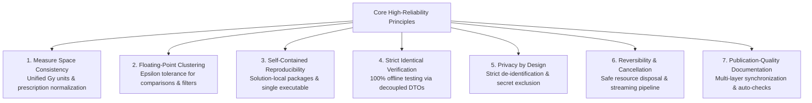

# Standard Software Development Lifecycle Protocol (SDLP)

**English** | [日本語](STANDARD_DEVELOPMENT_PLAN.md)

This document formalizes the standard software development lifecycle protocol and engineering quality principles designed to achieve both **maximum development efficiency** and **absolute mathematical accuracy and robustness** for large-scale Varian Eclipse ESAPI data mining applications.

---

## 1. Core Architectural Philosophy & 7 Quality Principles

To eliminate critical inconsistencies, mathematical breakdowns, resource leaks, data confidentiality breaches, and engineering regressions, all development adheres strictly to the **7 Core Principles**:



### 1.1 Measure Space Consistency Principle
* **Unified Gy Units**: All internal dose models, CSV columns, and JSONL records standardize strictly on `Gy` (using `DoseNormalizationHelper.ToGy()`).
* **Prescription Total Dose Normalization**: Relative dose parameters (e.g., V70%) normalize against the plan's prescription Total Dose (`PlanSetup.TotalDose`).

### 1.2 Floating-Point Clustering Principle
* **Epsilon Clustered Comparison**: Prohibits raw `==` comparisons on floating-point quantities (Gy, cc, MU). All boundary queries enforce an epsilon tolerance ($\epsilon = 10^{-4}$).

### 1.3 Self-Contained Reproducibility Principle
* **Local Package Management**: NuGets are restored into the solution-relative `packages/` directory (`nuget.config`).
* **Single Standalone Executable**: Generates an all-in-one binary via `Costura.Fody` (excluding ESAPI DLLs).

### 1.4 Strict Identical Verification Principle
* **DTO-Based Decoupling**: Maps ESAPI structures into plain C# models (`ExtractionPlanRecord`), validating CSV/JSONL serialization and filtering logic offline via 116 MSTest unit tests (AAA pattern).

### 1.5 Privacy by Design Principle
* **De-Identification Pipeline**: Irreversible salted SHA-256 hashing for Patient IDs, and `REDACTED` masking for birth dates and staff names.
* **Secret Scrubbing**: Zero internal IP addresses, local usernames, or UNC paths committed to source code or documentation.

### 1.6 Reversibility & Cancellation Principle
* **Isolated STA Worker Thread**: Background worker thread prevents UI blocking.
* **Resource Safety**: Deterministic `ClosePatient()` in `finally` blocks, periodic `GC.Collect()` every 200 patients, and instantaneous cooperative cancellation.

### 1.7 Publication-Quality Documentation Principle
* **Synchronized Documentation**: Full synchronization across source code, settings, and documentation in both English and Japanese.

---

## 2. 4-Layer Definition of Done (DoD) Quality Gates

```
[Layer 1: Build Integrity Gate]
  - MSBuild (Release|x64) 0 warnings, 0 errors
  - Costura.Fody single EXE verification (ESAPI excluded)
  ↓
[Layer 2: Automated Unit Testing Gate]
  - MSTest 100% (116/116) PASS
  - Complex geometry & DVH benchmark validation
  ↓
[Layer 3: Delivery Packaging Gate]
  - Release artifacts synchronized to release/
  - Startup smoke testing verified
  ↓
[Layer 4: Documentation Synchronization Gate]
  - README, MANUAL, and technical specifications updated in both English and Japanese
```
