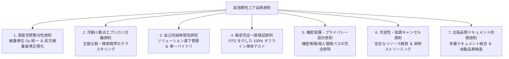

# 高信頼性ソフトウェア標準開発計画仕様書 (Standard Software Development Lifecycle Protocol: SDLP)

本ドキュメントは、Varian Eclipse ESAPI による大量治療計画データマイニング、外部連携、GUI/ストリーミング処理、および厳格な品質管理が求められるソフトウェア開発において、**「最高峰の開発効率」** と **「絶対的な計算正確性・堅牢性」** を両立するための標準開発計画・ワークフロー規約を体系化したものです。

---

## 1. コア設計思想と 7 大品質原則 (7 Core Principles)

本プロトコルは、重大な不整合、計算公理の破綻、リソースリーク、機密漏洩、および開発の停滞を未然に根絶するために導出された、以下の **7 つの原則** に基づきます。



### 1.1 測度空間整合性原則 (Measure Space Consistency Principle)
* **線量単位 Gy 統一**: ESAPI の内部単位（`cGy` / `Gy`）の混在を根絶するため、線量取得はすべて `DoseNormalizationHelper.ToGy()` 拡張メソッドを経由し、内部データモデルおよび出力 CSV / JSONL の線量はすべて `Gy` 単位に統一する。
* **処方総線量による正規化整合性**: 相対線量指標（例: V70% 等）の計算基準には、計画の処方総線量（`PlanSetup.TotalDose`）を強制適用する。

### 1.2 浮動小数点エプシロン分離原則 (Floating-Point Clustering Principle)
* **実数比較の許容誤差**: 線量値（Gy）や体積（cc）、MU 値の比較・フィルタリング判定において、生値の `==` 比較を禁止し、微小許容誤差（$\epsilon = 10^{-4}$）を介在させた許容幅判定を行う。

### 1.3 自己完結再現性原則 (Self-Contained Reproducibility Principle)
* **ソリューション直下管理**: 開発端末や CI 環境のグローバル NuGet キャッシュに依存せず、ソリューション直下の `packages/` ディレクトリに依存アセンブリを配置する（`nuget.config` でローカル固定）。
* **単一自己完結バイナリ**: 成果物は外部 DLL 欠落エラーを根絶する**単一自己完結バイナリ（`Costura.Fody` による依存アセンブリ内包）**として出力する（※ESAPI DLL は除外）。

### 1.4 厳密完全一致検証原則 (Strict Identical Verification Principle)
* **中間 DTO による疎結合**: ESAPI オブジェクトを純粋な C# モデル（`ExtractionPlanRecord` 等）へ即時マッピングし、CSV / JSONL ストリーミング出力、サニタイズ、検索論理判定は ESAPI 非接続環境で 100% 単体テスト（AAA パターン）で検証する。

### 1.5 機密保護・プライバシー設計原則 (Privacy & Secret Protection Principle)
* **匿名化パイプライン**: 院外研究・共同研究用途向けに、Patient ID の不可逆 SHA-256 ハッシュ化および個人情報（生年月日、承認者氏名）の `REDACTED` マスキングを実装。
* **機密情報のコミット排除**: 院内 IP アドレス、ローカルユーザー名（Windows ユーザー名）、個人プロファイルパス、共有フォルダ UNC パスをコードおよびドキュメントに一切残さない。

### 1.6 可逆性・協調キャンセル原則 (Reversibility & Cancellation Principle)
* **STA ワーカースレッドの完全分離**: ESAPI の STA 制約を遵守し、UI スレッドを一切ブロックしない専用スレッドで直列実行する。
* **メモリ安全設計**: 1 患者ごとの決定論的 `app.ClosePatient()` 実行、および 200 患者ごとの明示的 `GC.Collect()` により、10,000 件規模の長時間走査でもメモリリークを発生させない。
* **協調キャンセル**: `CancellationToken` による安全な停止を保証し、キャンセル時もそこまでに抽出されたデータが破損なくディスクに保存される。

### 1.7 出版品質ドキュメント同期原則 (Publication-Quality Documentation Principle)
* **完全同期管理**: コード、設定、ドキュメント（README, ARCHITECTURE, COMMISSIONING, TROUBLESHOOTING, CONTRIBUTING, CHANGELOG, MANUAL）の記述を常に完全同期させ、古い仕様の残存を排除する。

---

## 2. 4層 DoD (Definition of Done) 品質ゲート

新機能の実装や改修が完了したとみなすための「完了の定義（DoD）」を 4 つのゲートで定義します。

```
[Layer 1: ビルド整合性ゲート]
  ・MSBuild (Release|x64) にて 0 警告・0 エラー
  ・Costura.Fody による単一 EXE 生成確認 (ESAPI 除外確認)
  ↓
[Layer 2: 自動単体テストゲート]
  ・MSTest 全件実行にて 100% (24/24) PASS
  ・線量正規化、サニタイズ、ストリーミング、検索論理、マッピング
  ↓
[Layer 3: 臨床受入・コミッショニングゲート]
  ・COMMISSIONING.md に基づく代表症例での抽出精度検証
  ・Eclipse 画面上の DVH 統計値との厳密一致確認
  ↓
[Layer 4: 出版品質ドキュメント同期ゲート]
  ・全ドキュメント（README, MANUAL, 設計書, CHANGELOG）の最新同期
  ・test.bat による全自動パイプラインの正常完了
```

---

## 3. リリース・配布規約

1. **成果物の一元集約**:
   - `test.bat` を実行し、`release/` ディレクトリに以下のファイルが集約されていることを確認します：
     - `EclipseDataMiner.exe` (単一実行バイナリ)
     - `Templates/` (DQP および輪郭マッピングのサンプルファイル一式)
2. **コミッショニング承認の取得**:
   - `COMMISSIONING.md` の記録票に医学物理責任者の承認印を受領した上で、臨床ネットワーク端末への配備を実施します。
